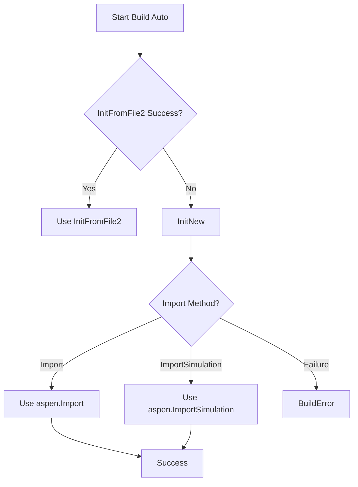

# Session Management

## Overview

The `aspen_automation.session` module provides a robust interface for orchestrating Aspen Plus simulations. It handles connection management, file generation, simulation execution, and result collection.

## Build Modes

| Mode | Description | Mechanism |
| :--- | :--- | :--- |
| `auto` | Default. Tries `InitFromFile2`, falls back to `InitNew` + `Import`. | Hybrid |
| `inp_only` | Generates INP and uses `InitFromFile2`. | File-based |
| `com_only` | Uses direct COM manipulation (Diagnostic). | COM (Not Implemented) |

## Auto Fallback Logic



## API Reference

### `run_simulation_session`

Orchestrates the entire session.

**Signature:**

```python
def run_simulation_session(
    spec: Union[PlantSpecification, Dict[str, Any]], 
    build_mode: str = "auto",
    output_dir: str = "results/",
    visible: bool = True,
    timeout_seconds: int = 300,
    keep_alive: bool = False
) -> SessionResult
```

### `SessionResult`

Data class containing simulation results.

**Fields:**

- `convergence_status` (bool): Whether the simulation converged.
- `build_mode` (str): Mode used ("auto", "inp_only", "com_only").
- `build_mechanism_used` (str): Mechanism that succeeded ("InitFromFile2", "Import", etc.).
- `build_fallback_attempted` (bool): Whether fallback was triggered in auto mode.
- `simulation_time_seconds` (float): Duration of the simulation.
- `diagnostics` (List[str]): Logs and error messages.
- `aspen` (Any): COM object reference (if `keep_alive=True`).

## COM Limitations

- `win32com.client` must be available (Windows only).
- `AspenConnectionError` is raised if connection fails or library is missing.

## Pipeline Integration

Use `run_simulation_session` in compliant CI/CD pipelines to validate plant specifications automatically.

## Troubleshooting

- **ImportError**: Ensure `pywin32` is installed.
- **AspenConnectionError**: Check if Aspen Plus is installed and license is active.
- **BuildError**: Verify INP generation syntax and file permissions.
- **SimulationError**: Check simulation timeout and convergence parameters.
