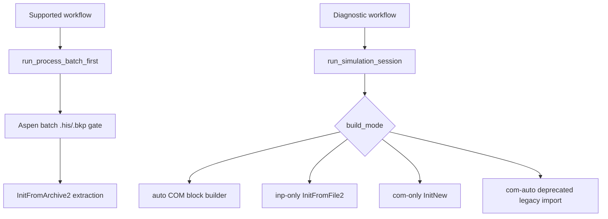

# Session Management

## Overview

The `aspen_automation.session` module provides a robust interface for orchestrating Aspen Plus simulations. It handles connection management, file generation, simulation execution, and result collection.

## Build Modes

For supported process-library runs, prefer `run_process_batch_first(...)`. It generates INP, verifies Aspen batch translation, then loads the batch-created BKP with `InitFromArchive2` before extracting CSV/JSON results. The session build modes below remain available for diagnostics and compatibility.

| Mode | Description | Mechanism |
| :--- | :--- | :--- |
| `auto` | Legacy diagnostic path. Builds through the live COM block builder. | COM block builder |
| `inp-only` | Generates INP and uses `InitFromFile2`. | File-based |
| `com-only` | Uses direct COM manipulation (Diagnostic). | COM (Diagnostic/dev, implemented) |
| `com-auto` | Deprecated diagnostic path retained for compatibility. | Legacy INP import/archive fallback |

## Diagnostic Build Paths



## API Reference

### `run_simulation_session`

Orchestrates the entire session.

**Signature:**

```python
def run_simulation_session(
    spec: Union[PlantSpecification, Dict[str, Any]], 
    build_mode: str = "auto",
    output_dir: str = "results/",
    visible: bool = True,
    timeout_seconds: int = 300,
    keep_alive: bool = False,
    raise_on_connection_error: bool = False
) -> SessionResult
```

**Parameters:**

| Name | Type | Default | Description |
| :--- | :--- | :--- | :--- |
| `spec` | `Union[PlantSpecification, Dict[str, Any], str]` | - | Specification model, raw dict, or file path. |
| `build_mode` | `str` | `"auto"` | One of `"auto"`, `"inp-only"`, `"com-only"`, `"com-auto"` for diagnostic sessions. |
| `output_dir` | `str` | `"results/"` | Directory for intermediate/output artifacts. |
| `visible` | `bool` | `True` | Whether Aspen UI is visible. |
| `timeout_seconds` | `int` | `300` | Maximum simulation runtime before timeout. |
| `keep_alive` | `bool` | `False` | If `True`, keeps Aspen session open and preserves `aspen` object. |
| `raise_on_connection_error` | `bool` | `False` | If `True`, re-raises `AspenConnectionError` instead of soft-failing. |

### `SessionResult`

Data class containing simulation results.

**Fields:**

- `convergence_status` (str): `"converged"`, `"failed"`, `"timeout"`, or `"unknown"`.
- `build_mode` (str): Mode used ("auto", "inp-only", "com-only").
- `build_mechanism_used` (str): Mechanism that succeeded ("InitFromFile2", "Import", etc.).
- `build_fallback_attempted` (bool): Whether fallback was triggered in auto mode.
- `simulation_time_seconds` (float): Duration of the simulation.
- `diagnostics` (Dict[str, Any]): Logs and error/context values.
- `aspen` (Any): COM object reference (if `keep_alive=True`).

## COM Limitations

- `win32com.client` must be available (Windows only).
- `AspenConnectionError` is raised if connection fails or library is missing.

## Pipeline Integration

Use `run_process_batch_first(...)` for supported process-library execution. Use `run_simulation_session` only for low-level diagnostic sessions where a live COM build mode is intentionally being tested.

## Troubleshooting

- **ImportError**: Ensure `pywin32` is installed.
- **AspenConnectionError**: Check if Aspen Plus is installed and license is active.
- **BuildError**: Verify INP generation syntax and file permissions.
- **SimulationError**: Check simulation timeout and convergence parameters.
